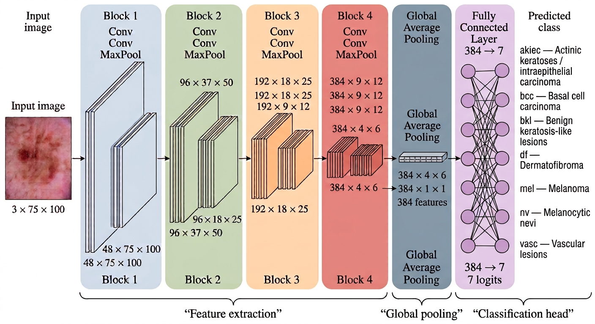

# Skin Lesion Classification with a Convolutional Neural Network

Deep learning project for multiclass classification of dermoscopic skin lesions using the **HAM10000** dataset.

The project was developed as part of the **AI for Medicine** course at the University of Bologna.

<p align="center">
  
</p>

## Overview

This project investigates the automatic classification of dermoscopic images using a convolutional neural network trained from scratch.

The model receives an RGB dermoscopic image with dimensions `3 × 75 × 100` and produces seven output logits corresponding to the diagnostic categories contained in the HAM10000 dataset.

Particular attention was given to:

- prevention of lesion-level data leakage;
- severe class imbalance;
- group-based cross-validation;
- class-weighted training;
- balanced performance metrics;
- clinically relevant binary ROC analyses.

---

## Dataset

The project uses the **HAM10000** dataset.

The processed dataset contains:

- **10,015 dermoscopic images**
- **7,470 unique skin lesions**
- **7 diagnostic classes**

The diagnostic categories are:

| Code | Diagnosis |
|---|---|
| `akiec` | Actinic keratoses and intraepithelial carcinoma |
| `bcc` | Basal cell carcinoma |
| `bkl` | Benign keratosis-like lesions |
| `df` | Dermatofibroma |
| `mel` | Melanoma |
| `nv` | Melanocytic nevi |
| `vasc` | Vascular lesions |

Multiple images may correspond to the same lesion.

For this reason, dataset partitioning was performed at the **lesion level**, rather than at the individual image level.

The dataset itself is not included in this repository.

Further information is available in `data/README.md`.

---

## Data Splitting Strategy

To prevent data leakage, all images corresponding to the same `lesion_id` were assigned to the same dataset partition.

The unique lesions were randomly divided as follows:

**85% Cross-validation dataset → 15% Independent test dataset**

Five-fold cross-validation was then performed using:

```python
GroupKFold(n_splits=5)
```

with `lesion_id` as the grouping variable.

The independent test set was kept completely separate from training, validation and model selection.

---

## Model Architecture

The proposed convolutional neural network contains four convolutional blocks.

Each block follows the general structure:

**Convolution → Batch Normalization → ReLU → Convolution → Batch Normalization → ReLU → Max Pooling**

The number of feature channels progressively increases:

**3 → 48 → 96 → 192 → 384**

while the spatial resolution progressively decreases:

**75 × 100 → 37 × 50 → 18 × 25 → 9 × 12 → 4 × 6**

After the convolutional blocks, Global Average Pooling reduces the final feature maps to a 384-dimensional representation.

The complete dimensional transformation is:

**3 × 75 × 100 → 48 × 37 × 50 → 96 × 18 × 25 → 192 × 9 × 12 → 384 × 4 × 6 → 384 → 7 logits**

The architecture is implemented in `src/model.py`.

---

## Data Augmentation

Training images are augmented using:

- random horizontal flipping;
- random vertical flipping;
- random rotations up to ±20°.

A stronger augmentation pipeline is applied to selected minority classes and additionally includes small variations in:

- brightness;
- contrast;
- saturation.

The augmentation and dataset logic are implemented in `src/dataset.py`.

---

## Loss Function

Because HAM10000 is strongly imbalanced, training uses a weighted cross-entropy loss.

For class `c`, the weight is calculated independently inside each training fold as:

**w_c = N / (K × N_c)**

where:

- `N` = number of training images;
- `K` = number of diagnostic classes;
- `N_c` = number of training images belonging to class `c`.

This increases the contribution of minority classes during optimization.

---

## Training

The main training configuration is:

| Parameter | Value |
|---|---:|
| Optimizer | Adam |
| Learning rate | 0.0001 |
| Batch size | 32 |
| Epochs | 50 |
| Cross-validation folds | 5 |

A new model is initialized for every fold.

For each fold, the model achieving the highest **validation balanced accuracy** is selected.

The training pipeline is implemented in `src/training.py`.

---

## Evaluation Metrics

Because of the strong class imbalance, conventional accuracy alone is not sufficient to evaluate model performance.

Three main metrics were therefore considered:

- **Accuracy**
- **Balanced Accuracy**
- **Macro F1 Score**

Accuracy measures the overall proportion of correctly classified images.

Balanced Accuracy corresponds to the mean recall across the seven diagnostic classes and therefore reduces the influence of the highly represented majority class.

Macro F1 calculates the F1 score independently for each diagnostic class and then takes their arithmetic mean, giving equal importance to all seven classes regardless of their prevalence.

The evaluation pipeline is implemented in `src/evaluation.py`.

---

## Results

The five models obtained from five-fold cross-validation were independently evaluated on the same held-out test set.

| Model | Accuracy | Balanced Accuracy | Macro F1 |
|---|---:|---:|---:|
| 1 | 0.6521 | 0.6587 | 0.4635 |
| 2 | 0.6709 | 0.6735 | 0.4884 |
| 3 | **0.7234** | **0.6873** | **0.5664** |
| 4 | 0.6931 | 0.6746 | 0.5137 |
| 5 | 0.6945 | 0.6847 | 0.4893 |

Mean performance across the five models:

| Metric | Mean ± SD |
|---|---:|
| Accuracy | **0.6868 ± 0.0241** |
| Balanced Accuracy | **0.6758 ± 0.0101** |
| Macro F1 | **0.5043 ± 0.0349** |

The average conventional accuracy was therefore approximately **68.7%**, while the average balanced accuracy was approximately **67.6%**.

The mean Macro F1 score was approximately **50.4%**.

Among the five independently trained models, **Model 3 achieved the best performance according to all three reported metrics**, reaching:

**Accuracy 0.7234 → Balanced Accuracy 0.6873 → Macro F1 0.5664**

The relatively small variability in balanced accuracy across the five folds suggests that the ability of the network to recognize the different diagnostic classes remained reasonably stable across different training-validation partitions.

---

## ROC Analysis

Two clinically relevant binary classification analyses were additionally performed.

### Melanocytic nevi vs all other lesions

The seven output logits are transformed into probabilities using the softmax function.

The probability assigned to the `nv` class is then used as the binary prediction score:

**7 logits → Softmax probabilities → P(nv) → ROC curve**

The binary target is defined as:

- `1` → melanocytic nevus;
- `0` → any other lesion.

### Malignant vs non-malignant lesions

The malignant group is defined as:

**mel + bcc + akiec**

The corresponding malignancy probability is obtained by summing the probabilities assigned to these three diagnostic classes:

**7 logits → Softmax probabilities → P(mel) + P(bcc) + P(akiec) → P(malignant)**

This score is then used to calculate the Receiver Operating Characteristic curve and the corresponding Area Under the Curve.

The analysis is performed independently for each of the five models.

---

## Repository Structure

```text
HAM10000-CNN-Classification/
│
├── README.md
├── requirements.txt
├── .gitignore
│
├── data/
│   └── README.md
│
├── figures/
│   └── cnn_architecture.jpg
│
├── models/
│   └── README.md
│
├── notebooks/
│   └── skin_lesion_classification.ipynb
│
└── src/
    ├── __init__.py
    ├── dataset.py
    ├── evaluation.py
    ├── model.py
    └── training.py
```

The final project report will also be included in the repository once completed.

---

## Installation

Clone the repository:

```bash
git clone https://github.com/lorenzovaresio/HAM10000-CNN-Classification.git
```

Move into the project directory:

```bash
cd HAM10000-CNN-Classification
```

Install the required Python packages:

```bash
python -m pip install -r requirements.txt
```

---

## Usage

The complete experimental workflow is available in:

`notebooks/skin_lesion_classification.ipynb`

The reusable Python components are contained in the `src` directory.

The dataset should be placed locally at:

`data/HAM10000_data.pkl`

The dataset file is intentionally excluded from Git version control.

---

## Limitations

The main limitations of the current project include:

- severe class imbalance;
- limited representation of rare diagnostic categories;
- relatively low image resolution;
- training from scratch rather than transfer learning;
- absence of patient metadata in the predictive model;
- limited systematic hyperparameter optimization.

---

## Future Work

Possible extensions include:

- transfer learning with pretrained convolutional architectures;
- alternative strategies for class imbalance;
- improved class-dependent data augmentation;
- systematic hyperparameter optimization;
- incorporation of age, sex and anatomical localization;
- model calibration;
- further clinically relevant binary classification tasks.

---

## Reference

Tschandl, P., Rosendahl, C., & Kittler, H.  
**The HAM10000 dataset: A large collection of multi-source dermatoscopic images of common pigmented skin lesions.**  
*Scientific Data*, 5, 180161 (2018).

---

## Disclaimer

This project was developed for academic purposes.

The resulting models are experimental machine learning systems and are **not intended for clinical diagnosis or medical decision-making**.