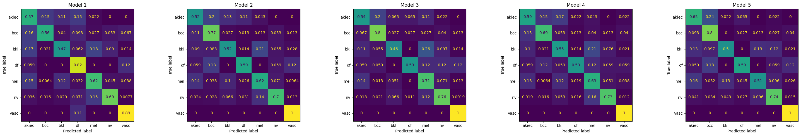

# Skin Lesion Classification Using a Convolutional Neural Network

Deep learning project for automatic multiclass classification of dermoscopic skin lesions using the **HAM10000** dataset.

Developed for the **AI for Medicine** course at the **University of Bologna**.

<p align="center">
  
</p>

---

## Project Overview

Skin lesions include both benign conditions and malignant neoplasms, for which delayed diagnosis may negatively affect patient outcomes.

This project investigates whether a convolutional neural network trained directly on dermoscopic images can learn visual representations useful for distinguishing the seven diagnostic categories included in HAM10000.

Given an RGB dermoscopic image of size `3 × 75 × 100`, the model produces seven diagnostic logits:

**3 × 75 × 100 → CNN → 7 logits → Predicted diagnostic class**

In addition to the seven-class classification task, two clinically relevant binary discrimination problems were investigated:

- melanocytic nevi (`nv`) vs all other lesions;
- malignant vs non-malignant lesions.

---

## Dataset

The project uses the **HAM10000** dermoscopic image dataset.

The processed dataset contains:

- **10,015 images**
- **7,470 unique lesions**
- **7 diagnostic classes**
- image dimensions of **100 × 75 × 3**

Multiple images may correspond to the same lesion, meaning that the total number of images is larger than the number of independent lesions.

### Diagnostic Classes

| Code | Diagnosis |
|---|---|
| `akiec` | Actinic keratoses and intraepithelial carcinoma / Bowen's disease |
| `bcc` | Basal cell carcinoma |
| `bkl` | Benign keratosis-like lesions |
| `df` | Dermatofibroma |
| `mel` | Melanoma |
| `nv` | Melanocytic nevi |
| `vasc` | Vascular lesions |

The numerical label mapping used during training is:

**akiec → 0 → bcc → 1 → bkl → 2 → df → 3 → mel → 4 → nv → 5 → vasc → 6**

HAM10000 is strongly imbalanced. Melanocytic nevi represent the majority of observations, whereas dermatofibroma and vascular lesions are among the rarest classes.

This imbalance motivated both **class-weighted training** and the use of **class-balanced evaluation metrics** rather than relying on conventional accuracy alone.

---

## Preventing Data Leakage

A central methodological issue in HAM10000 is that multiple images may originate from the same lesion.

Randomly splitting individual images could therefore place different images of the same lesion in both training and evaluation sets, introducing information leakage and producing an overly optimistic estimate of performance.

For this reason, all dataset partitions were created at the level of `lesion_id`.

The unique lesions were randomly shuffled using a seed of `42` and divided as follows:

**85% of lesions → cross-validation dataset → 8,529 images**

**15% of lesions → independent test set → 1,486 images**

Within the development dataset, five-fold cross-validation was performed using:

```python
GroupKFold(n_splits=5)
```

with `lesion_id` as the grouping variable.

This guarantees that all images belonging to the same lesion remain entirely within either the training or validation partition of a given fold.

The independent test set was kept completely separate from:

- model fitting;
- epoch selection;
- model selection;
- architecture development;
- hyperparameter decisions.

This allows the final evaluation to better reflect generalization to previously unseen lesions.

---

## Data Preprocessing and Augmentation

Images were converted from:

**Height × Width × Channels → Channels × Height × Width**

and pixel values were scaled from:

**[0, 255] → [0, 1]**

The standard training augmentation pipeline includes:

- random horizontal flipping with probability `0.5`;
- random vertical flipping with probability `0.5`;
- random rotation between `-20°` and `+20°`.

A stronger augmentation pipeline was additionally used for selected minority classes and introduced approximately 10% random variation in:

- brightness;
- contrast;
- saturation.

The dataset and augmentation logic are implemented in:

`src/dataset.py`

---

## CNN Architecture

The final model contains approximately **2.64 million trainable parameters**.

It is composed of four convolutional blocks followed by Global Average Pooling and a fully connected classification layer.

Each convolutional block follows the structure:

**Convolution → Batch Normalization → ReLU → Convolution → Batch Normalization → ReLU → Max Pooling**

All convolutions use:

- kernel size: `3 × 3`
- padding: `1`
- stride: `1`

Each block ends with `2 × 2` max pooling.

The number of feature channels progressively increases:

**3 → 48 → 96 → 192 → 384**

while spatial resolution progressively decreases:

**75 × 100 → 37 × 50 → 18 × 25 → 9 × 12 → 4 × 6**

The complete dimensional transformation is:

**3 × 75 × 100 → 48 × 37 × 50 → 96 × 18 × 25 → 192 × 9 × 12 → 384 × 4 × 6 → 384 → 7 logits**

Global Average Pooling transforms the final `384 × 4 × 6` tensor into a 384-dimensional representation.

The final fully connected layer then maps:

**384 features → 7 diagnostic logits**

The architecture is implemented in:

`src/model.py`

---

## Loss Function

Because of the severe class imbalance, the network was trained using **weighted cross-entropy**.

For each class `c`, its weight is computed exclusively from the training portion of the corresponding fold:

**w_c = N_train / (K × N_c)**

where:

- `N_train` is the total number of training images;
- `K = 7` is the number of diagnostic classes;
- `N_c` is the number of training images belonging to class `c`.

Computing the weights independently within each training fold ensures that validation and test distributions do not influence the optimization objective.

Loss weighting and evaluation metrics address two different aspects of class imbalance:

**weighted loss → modifies learning**

**balanced metrics → modify performance reporting**

---

## Training Strategy

The final training configuration was:

| Parameter | Value |
|---|---:|
| Optimizer | Adam |
| Learning rate | `1 × 10⁻⁴` |
| Batch size | 32 |
| Epochs | 50 |
| Cross-validation folds | 5 |
| Model-selection metric | Validation Balanced Accuracy |

A completely new CNN was initialized for each fold.

After every epoch, validation balanced accuracy was computed and the model state corresponding to the highest value was retained.

This produced five independently trained models:

```text
best_model_fold_1.pth
best_model_fold_2.pth
best_model_fold_3.pth
best_model_fold_4.pth
best_model_fold_5.pth
```

The training pipeline is implemented in:

`src/training.py`

---

## Evaluation Metrics

Because HAM10000 is strongly imbalanced, evaluation focuses primarily on metrics that give equal importance to diagnostic classes.

The three main reported metrics are:

### Accuracy

Overall proportion of correctly classified images.

### Balanced Accuracy

Arithmetic mean of class-specific recalls:

**Balanced Accuracy = mean recall across the seven diagnostic classes**

### Macro F1 Score

The F1 score is computed independently for each class and then averaged with equal weight.

Normalized confusion matrices were additionally used to investigate class-specific errors and systematic misclassification patterns.

The evaluation pipeline is implemented in:

`src/evaluation.py`

---

## Test Set Results

The five retained models were independently evaluated on the same held-out test set containing **1,486 images**.

| Model | Accuracy | Balanced Accuracy | Macro F1 |
|---|---:|---:|---:|
| 1 | 0.6521 | 0.6587 | 0.4635 |
| 2 | 0.6709 | 0.6735 | 0.4884 |
| **3** | **0.7234** | **0.6873** | **0.5664** |
| 4 | 0.6931 | 0.6746 | 0.5137 |
| 5 | 0.6945 | 0.6847 | 0.4893 |

### Mean Performance

| Metric | Mean ± SD |
|---|---:|
| Accuracy | **0.6868 ± 0.0241** |
| Balanced Accuracy | **0.6758 ± 0.0101** |
| Macro F1 | **0.5043 ± 0.0349** |

Among the five trained models, **Model 3 achieved the strongest performance across all three reported metrics**:

**Accuracy 0.7234 → Balanced Accuracy 0.6873 → Macro F1 0.5664**

---

## Normalized Confusion Matrices

Class-specific behavior was investigated using row-normalized confusion matrices.

Each row corresponds to the true diagnostic class and each column to the predicted class.

Because normalization is performed with respect to the true class:

**each row sums to 1 → diagonal values represent class-specific recall**

Off-diagonal values indicate systematic misclassification between diagnostic categories.

<p align="center">
  
</p>

The matrices show that performance remains heterogeneous across diagnostic categories, particularly for some of the rarer classes.

---

## Binary ROC Analyses

In addition to multiclass classification, two binary discrimination tasks were evaluated using Receiver Operating Characteristic curves.

### Melanocytic Nevi vs All Other Lesions

The seven output logits were converted into probabilities using softmax.

The probability assigned to the `nv` class was used as the binary score:

**7 logits → Softmax → P(nv) → ROC curve**

Across the five models, ROC Area Under the Curve values were approximately in the **0.92–0.94** range, indicating substantially stronger binary discrimination than exact seven-class classification.

### Malignant vs Non-Malignant Lesions

The malignant group was defined as:

**mel + bcc + akiec**

The malignancy score was calculated as:

**P(malignant | x) = P(mel) + P(bcc) + P(akiec)**

Therefore:

**7 logits → Softmax → P(mel) + P(bcc) + P(akiec) → ROC curve**

Across the five models, Area Under the Curve values were approximately in the **0.88–0.90** range.

These results suggest that the learned visual representation contains clinically meaningful information even when exact seven-class discrimination remains more difficult.

---

## Development Experiments

Several alternative architectures were explored during development before selecting the final CNN.

These included:

- convolutional networks with a larger number of channels and parameters;
- Transformer-based extensions applied to the final convolutional representation;
- alternative loss-weighting strategies;
- architectural modifications intended to increase model capacity.

Increasing model complexity did not improve final validation performance and frequently increased the gap between training and validation behavior.

This is consistent with the limited amount of independent information available in HAM10000:

**10,015 images → 7,470 unique lesions**

Because multiple images may represent the same lesion, the effective number of independent observations is closer to the number of lesions than to the total number of images.

The final architecture therefore favors a relatively compact representation:

**384 × 4 × 6 → Global Average Pooling → 384 features → Linear classifier**

rather than a substantially larger classification head.

---

## Main Limitations

The principal limitations of the current project include:

- severe diagnostic class imbalance;
- very small numbers of examples for rare classes;
- training from scratch rather than using a pretrained image model;
- relatively low image resolution (`100 × 75`);
- omission of available clinical variables such as age, sex, and anatomical localization;
- absence of systematic nested cross-validation for hyperparameter optimization;
- absence of external validation on an independent dataset.

The model should therefore be considered an academic machine-learning prototype rather than a clinical diagnostic system.

---

## Future Work

Possible extensions include:

- transfer learning with pretrained convolutional architectures;
- improved strategies for minority-class augmentation;
- alternative approaches to class imbalance;
- systematic hyperparameter optimization;
- integration of age, sex, and anatomical localization;
- model calibration;
- explicit threshold selection based on sensitivity and specificity;
- external validation on independent clinical datasets.

---

## Repository Structure

```text
HAM10000-CNN-Classification/
│
├── README.md
├── requirements.txt
├── .gitignore
│
├── data/
│   └── README.md
│
├── figures/
│   ├── cnn_architecture.jpg
│   └── confusion_matrices_5_models.png
│
├── models/
│   └── README.md
│
├── notebooks/
│   └── skin_lesion_classification.ipynb
│
├── src/
│   ├── __init__.py
│   ├── dataset.py
│   ├── evaluation.py
│   ├── model.py
│   └── training.py
│
└── report/
    └── Final_Project.pdf
```

---

## Reproducibility

The project was implemented in Python using:

- PyTorch
- torchvision
- pandas
- NumPy
- scikit-learn
- Matplotlib

A random seed of `42` was used for the initial lesion-level split.

CUDA acceleration was used when available.

The complete experimental workflow is contained in:

`notebooks/skin_lesion_classification.ipynb`

Reusable components are available in the `src/` directory.

To install the required packages:

```bash
python -m pip install -r requirements.txt
```

The HAM10000 dataset itself is intentionally excluded from Git version control.

---

## Ethics and Data Privacy

This project uses the existing HAM10000 dataset and does not collect new patient data.

HAM10000 is publicly available through Harvard Dataverse for non-commercial use with attribution.

The machine-learning models developed here are intended exclusively for academic purposes and should not be interpreted as replacements for dermatological assessment or as standalone diagnostic medical devices.

---

## References

Tschandl, P., Rosendahl, C., & Kittler, H.  
**The HAM10000 dataset: A large collection of multi-source dermatoscopic images of common pigmented skin lesions.**  
*Scientific Data*, 5, 180161 (2018).

Paszke, A. et al.  
**PyTorch: An Imperative Style, High-Performance Deep Learning Library.**  
*Advances in Neural Information Processing Systems*, 2019.

---

## Disclaimer

This repository contains an **academic research project**.

The models and results presented here are experimental and are **not intended for clinical diagnosis, treatment decisions, or direct patient care**.